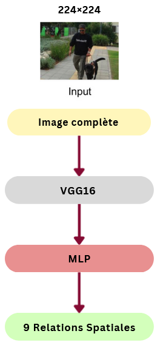

# Spatial Relations Identification in Images using Deep Learning Methods

> **Advanced neural network architectures for understanding spatial relationships between objects**

A comprehensive implementation exploring various deep learning approaches for identifying spatial relations in images, from traditional CNNs to advanced multimodal fusion techniques combining visual, geometric, and textual features.

## Overview

This repository contains the implementation of various deep learning approaches for identifying spatial relations in images. The project explores different architectures, from traditional CNNs to multimodal approaches combining visual, geometric, and textual features.

**Author:** ABED Nada-Fatima Zohra  
**Institution:** Université Paris Cité  
**Date:** June 20, 2025

<!-- Replace with slide 3 showing examples of spatial relations -->

## Problem Statement

Spatial relations are complex to model as they depend on position, scale, perspective, and semantic context. Traditional approaches rely solely on raw images without explicitly exploiting geometric or relational information between objects.

## Dataset: SpatialSense++

The SpatialSense++ dataset is used for training and evaluation with the following characteristics:

- **Total Images:** 10,440
- **Total Annotated Relations:** 17,498
- **Spatial Vocabulary:** 9 unique spatial relations
- **Object Categories:** 20 unique object types
- **Annotation System:** Binary labels (True/False) for each relation
- **Validated Relations:** 8,749 (50%)
- **Rejected Relations:** 8,749 (50%)

### Spatial Relations
- on
- behind  
- in front of
- next to
- under
- in
- above
- to the left of
- to the right of

## Methods

### Method 1: Haldekar (VGG16) - Baseline
- **Input:** Complete image 224×224
- **Backbone:** VGG16
- **Features:** 4096 dimensions
- **Classifier:** MLP (4096 → 512 → 256 → 9)

### Method 2: Vision Transformer
- **Input:** Complete image 224×224  
- **Tokenization:** 16×16 patches (196 patches + CLS token)
- **Backbone:** Vision Transformer (ViT-Base)
- **Features:** 768 dimensions
- **Classifier:** MLP (768 → 512 → 256 → 9)

### Method 3: Dual Architecture (Complete Image + Masking)
- **Input 1:** Complete image (RGB)
- **Input 2:** Masked regions outside bounding boxes (black)
- **Fusion:** Concatenation of VGG features (4096 + 4096 = 8192)
- **Classifier:** MLP (8192 → 512 → 256 → 9)

### Method 4: Dual Architecture (Complete Image + Binary Masking)
- **Input 1:** Complete image (RGB)
- **Input 2:** Binary mask of bounding boxes (White=objects, Black=background)
- **Fusion:** Concatenation of VGG features (4096 + 4096 = 8192)
- **Classifier:** MLP (8192 → 512 → 256 → 9)

### Method 5: Dual Architecture (Image + Geometric Features)
- **Modality 1:** Complete image → Pre-trained VGG16 (4096 features)
- **Modality 2:** Geometric features → Spatial MLP (28 → 256 → 512)
- **Fusion:** Concatenation (4096 + 512 = 4608 features)
- **Classifier:** MLP (4608 → 512 → 256 → 9)

<!-- Replace with slide 11 showing Method 5 architecture diagram -->

### Method 6: Multimodal Architecture (Image + Geometric Features + BERT Text)
- **Modality 1:** Complete image → Pre-trained VGG16 (4096 features)
- **Modality 2:** BBox coordinates → Spatial MLP (28 → 256 → 512)
- **Modality 3:** Text "subject object" → BERT encoder (768 features)
- **Fusion:** Concatenation (4096 + 512 + 768 = 5376 features)
- **Classifier:** MLP (5376 → 512 → 256 → 9)

<!-- Replace with slide 12 showing Method 6 architecture diagram -->

## Results

### Performance Comparison

| Method | Best Fold Accuracy | Average Accuracy |
|--------|-------------------|------------------|
| Method 1: Haldekar (VGG16) | 30.7% | 29.8% |
| Method 2: Vision Transformer | 31.02% | 30.4% |
| Method 3: Image + Masking | 31.6% | 30.59% |
| Method 4: Image + Binary Masking | 33.19% | 32.8% |
| Method 5: Image + Geometric Features | 42.35% | 40.33% |
| Method 6: Image + Geometric + BERT Text | **45.5%** | **43.3%** |

### Training Details
- **Cross-validation:** 5-folds
- **Early stopping patience:** 5
- **Min delta:** 0.001
- **Batch size:** 8

### Method 1 Results

### Method 4 Results  

### Method 5 Results
<!-- Replace with slide 16 showing Method 5 confusion matrix -->

### Method 6 Results

### Common Errors Analysis

The top 5 most frequent prediction errors across all methods:
- **in → on**
- **behind → on** 
- **in front of → behind**
- **on → behind**
- **above → on**

These errors highlight persistent confusions between semantically similar spatial relations.

---
- Université Paris Cité 
- SpatialSense++ dataset creators for the annotated spatial relations data
